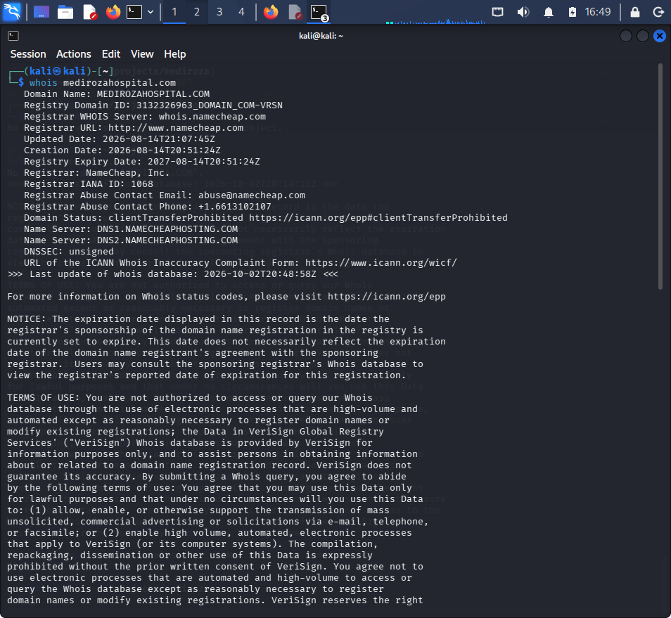
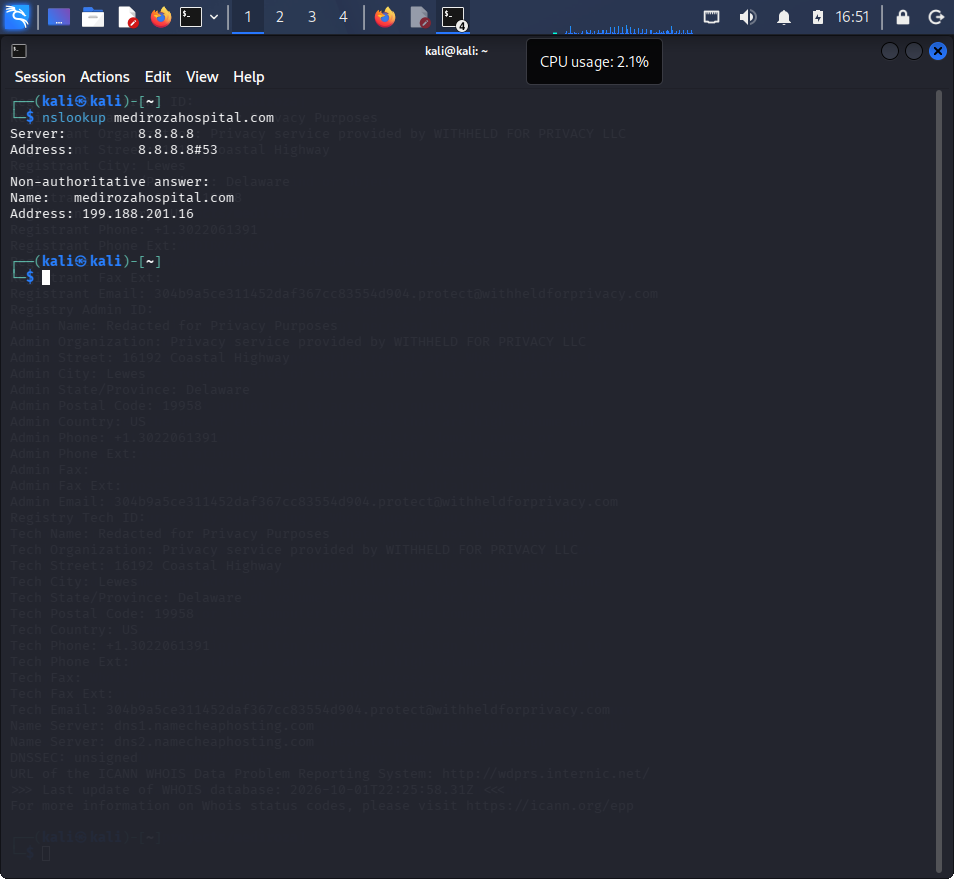
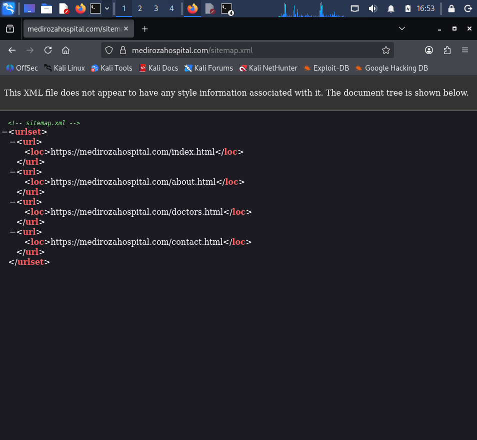

**Technical Report:** **Security Assessment & Data Recovery Walkthrough**

**Project Overview**
This project documents an end-to-end security assessment performed on medirozahospital.com. The objective was to identify host infrastructure using open-source intelligence (OSINT), uncover site endpoints, demonstrate SQL injection (SQLi) authentication bypass, perform file extractions, and decrypt password hashes to access internal records.

**Methodology & Tools Used**

*Reconnaissance & Footprinting:* whois, nslookup, sitemap.xml inspection

*Exploitation:* Authentication Bypass via SQL Injection (admin' --)

*Data Extraction:* Direct file extraction and local storage analysis

*Cryptographic Analysis:* Networkwalks Hash Calculator

*Credential Recovery:* Offline Hash Cracker / Wordlist Attack

**Step-by-Step Execution**

**Step 1:** **Reconnaissance & Intelligence Gathering**

The target domain medirozahospital.com was mapped using standard DNS and domain inspection utilities:

*Domain Ownership Analysis:* Executed whois to identify registrant details, name servers, and domain creation timelines:

*DNS Mapping:* Ran nslookup to resolve domain name system records and identify target server IP addresses:

*Directory Discovery:* Analyzed sitemap.xml at the site root ([https://medirozahospital.com/sitemap.xml](https://medirozahospital.com/sitemap.xml)) to identify hidden site structures and administrative navigation paths.

**Step 2:** **Web Exploitation (Authentication Bypass)**

During the assessment of the administrative login portal, an input validation flaw in the authentication mechanism was identified and exploited.

*Payload:* admin' --

*Mechanism:* Using SQL injection payload bypass syntax, the password field check was commented out in the underlying database query, granting administrative privilege without a valid plaintext password.

**Step 3:** **Artifact Extraction**

Once inside the administrative interface, access was established to three key protected target files containing hashed credential records.

**Step 4:** **Cryptographic Hashing & Cracking**

To recover the underlying credentials:

*Hash Identification:* Extracted hashes from the target files were processed using the Networkwalks Hash Calculator to determine algorithm type (e.g., MD5 / SHA-256).

*Password Cracking:* The calculated hashes were passed into an offline password cracker, successfully mapping the hash strings back to cleartext passwords.

**Technical Challenges & Troubleshooting**

Hands-on assessments frequently present unexpected environmental and technical hurdles. Below are the key challenges encountered during this lab and the troubleshooting steps taken to resolve them:

**DNS & Utility Configuration Errors:**

*Challenge:* Initial whois and nslookup queries failed to resolve or threw network syntax/timeout errors.

*Resolution:* Verified active network interfaces, validated local DNS settings (/etc/resolv.conf), and refreshed network services to ensure proper routing before re-running domain queries.

**Unrecognized Hash Formats:**

*Challenge:* Extracted credential hashes could not be processed immediately due to ambiguous formatting and missing algorithm headers.

*Resolution:* Utilized the Networkwalks Hash Calculator to cross-reference character lengths and encoding structure, correctly identifying the underlying hash type prior to feeding strings into the cracking utility.

**Password Cracker Mismatches & Bottlenecks:**

*Challenge:* The password cracker failed to match entries on initial passes due to misconfigured wordlist paths and rule parameters.

*Resolution:* Reconfigured the tool parameters, adjusted wordlist selections, and verified cracking syntax to achieve successful cleartext credential recovery.

**Findings & Data Exfiltration Analysis**
Upon gaining full authenticated access, the following sensitive internal datasets were accessed:

*Staff Directory & Credentials:* Full employee lists, roles, and plaintext passwords.

*Payroll Records:* Confidential staff salary breakdowns and financial data.

*Corporate Structure:* Sensitive details regarding hospital shareholders and internal ownership structures.

**Key Takeaways & Mitigation Recommendations**

Implement Parameterized Queries (Prepared Statements): Prevent SQL injection across all authentication forms by separating user input from database logic.

Restrict Directory Listing: Ensure sitemap.xml and robot files do not disclose confidential administrative portals or internal resources.

Strong Hashing Standards: Migrate from weak cryptographic hashes to strong key-derivation functions (e.g., bcrypt, Argon2) with unique salts per user.

Access Control Enforcement: Apply Least Privilege access controls to restrict authenticated accounts from viewing sensitive staff payroll and shareholder records without explicit authorization.

Author: Esther Mesirionye

Project: Networkwalks Security Assessment Series# Penetration-Testing-Project
This documents an end to end security assessment.
